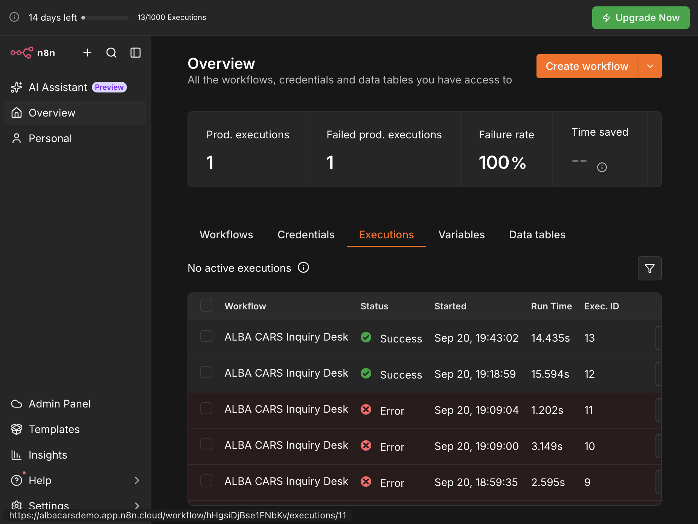

# ALBA CARS Inquiry Desk — n8n Workflow

Webhook automation that turns a website inquiry into a scored CRM lead: validate → classify with OpenAI → write to Supabase → return a reference → route confirmations, sales alerts, and voice-queue eligibility.

| Live surface | URL |
| --- | --- |
| n8n Cloud | https://albacarsdemo.app.n8n.cloud |
| Web app (submits to webhook) | https://alba-cars-web.vercel.app |
| Dashboard (verify leads / messages) | https://alba-cars-dashboard-dun.vercel.app |

**Reviewer login:** n8n Cloud email and password are in the Notes on my [Alba Dev Tests submission](https://devtest.albacars.ae/apply/onfbdgbvtx2hgz/test/6a4669f22063428fcf521f77) — not committed to git. Fallback without login: import [`alba-inquiry-workflow.json`](./alba-inquiry-workflow.json) using [ACTIVATE.md](./ACTIVATE.md).

---

## What and why

ALBA CARS’ public site historically pushed visitors to WhatsApp. That loses people who are not signed in, on desktop, or ready to leave the page.

This workflow backs an on-site inquiry desk:

1. Accept a structured inquiry over a webhook.
2. Validate contact, consent, and channel rules.
3. Upsert the customer and create a lead with an `AC-#####` reference.
4. Use OpenAI to classify intent, score urgency, and draft a confirmation.
5. Store drafted email / WhatsApp / sales-alert bodies in Supabase (delivery can stay `skipped` without a provider).
6. Queue voice-agent-ready rows when phone + consent allow.
7. Respond immediately with `{ ok, reference, lead_id, summary }` so the website can show a confirmation.

Reviewers can verify end-to-end without opening WhatsApp: the webhook JSON, Supabase rows, and the live dashboard.

---

## Repository contents

| Path | Purpose |
| --- | --- |
| [`alba-inquiry-workflow.json`](./alba-inquiry-workflow.json) | Importable workflow export |
| [`ACTIVATE.md`](./ACTIVATE.md) | Import → Variables → Active → Production URL |
| [`.env.example`](./.env.example) | Placeholder names for `$vars` / env (never real secrets) |
| [`sample-payloads/`](./sample-payloads/) | Happy-path and invalid-consent samples |
| [`scripts/run-samples.mjs`](./scripts/run-samples.mjs) | Optional local OpenAI + Supabase runner |
| [`docs/success-sample.json`](./docs/success-sample.json) | Captured successful webhook response |
| [`docs/success-execution.png`](./docs/success-execution.png) | Screenshot of a green Success execution |

---

## Setup and credentials

Never commit real API keys, JWTs, or n8n passwords.

n8n Cloud blocks `$env`. Use **Personal → Variables** (`$vars`). Names match [`.env.example`](./.env.example):

| Variable | Purpose |
| --- | --- |
| `OPENAI_API_KEY` | Classification and confirmation draft |
| `OPENAI_MODEL` | e.g. `gpt-5-nano` |
| `SUPABASE_URL` | `https://YOUR_PROJECT.supabase.co` |
| `SUPABASE_SERVICE_ROLE_KEY` | Service-role JWT for REST writes |
| `EMAIL_PROVIDER` / `WHATSAPP_PROVIDER` / `SALES_ALERT_PROVIDER` | Optional. If unset, communication rows store as `skipped` with drafted body |

Schema: apply SQL in [`../supabase/migrations`](../supabase/migrations). Tables used: `alba_customers`, `alba_leads`, `alba_communications`, `alba_processing_log`, `alba_voice_agent_queue`, `alba_ai_eval_runs`.

Step-by-step Cloud activation: **[ACTIVATE.md](./ACTIVATE.md)**.

---

## How to run

### Option A — Live Cloud instance (preferred for review)

1. Open https://albacarsdemo.app.n8n.cloud with credentials from the [submission Notes](https://devtest.albacars.ae/apply/onfbdgbvtx2hgz/test/6a4669f22063428fcf521f77).
2. Open workflow **ALBA CARS Inquiry Desk** (path `alba-inquiry`, must be Active / Published).
3. Trigger it:
   - Submit an inquiry on https://alba-cars-web.vercel.app, or
   - POST a sample payload (below).

### Option B — Import the JSON yourself

Follow [ACTIVATE.md](./ACTIVATE.md): import the JSON, set Variables, activate, copy the Production webhook URL into `N8N_WEBHOOK_URL`.

### Manual webhook POST

Sample files are shaped as `{ "name", "payload" }`. POST **only the payload**:

```bash
jq .payload sample-payloads/01-high-intent-rav4.json \
  | curl -sS -X POST "$N8N_WEBHOOK_URL" \
    -H 'Content-Type: application/json' \
    -d @-
```

Validation edge case (expect HTTP **400**):

```bash
jq .payload sample-payloads/06-invalid-missing-consent.json \
  | curl -sS -X POST "$N8N_WEBHOOK_URL" \
    -H 'Content-Type: application/json' \
    -d @-
```

### Optional local runner

Mirrors the pipeline without n8n (OpenAI + Supabase). From repo root, with env loaded:

```bash
node 03-n8n-workflow/scripts/run-samples.mjs
node 03-n8n-workflow/scripts/run-samples.mjs --file sample-payloads/01-high-intent-rav4.json
node 03-n8n-workflow/scripts/run-samples.mjs --eval-only
```

---

## Node-by-node walkthrough

Data flows left to right. Significant nodes and what they pass forward:

| Step | Node(s) | What happens |
| --- | --- | --- |
| 1 | **Inquiry Webhook** | Receives POST JSON (`responseMode: responseNode`). |
| 2 | **Validate Input** → **IF Validation OK** | Checks `submission_id`, email/phone, consent, channel rules. Fail → **Respond Validation Error** (400). |
| 3 | **Log Processing Start** | Inserts `alba_processing_log` (`processing`). `continueOnFail` so logging never kills the run. |
| 4 | **Check Duplicate Lead** → **Evaluate Duplicate** → **IF Duplicate Lead** | Same `submission_id` → **Log Duplicate Success** → **Respond Duplicate** with existing `reference`. |
| 5 | **Prepare Customer Lookup** → **Find Customer** → **IF Customer Exists** | Update or create in `alba_customers`. |
| 6 | **Resolve Customer Id** → **IF Customer Resolved** | Never throws. Fail → **Log Customer Failed** → **Respond Workflow Error** (500). |
| 7 | **Get Lead Reference RPC** → **Assign Reference** | `AC-#####` from RPC, or generated fallback. |
| 8 | **OpenAI Classify** → **Evaluate OpenAI Result** → **IF OpenAI Failed** | Success → **Extract OpenAI JSON**. Fail → log + **AI Fallback Template**. |
| 9 | **Parse AI and Apply Rules** | Clamps score, sets `hot` / `warm` / `early`, voice eligibility, confirmation text. |
| 10 | **Insert Lead** → **Evaluate Insert Lead** → **IF Insert Lead OK** | Fail → **Respond Insert Failed** (500). Success → **Attach Lead Id**. |
| 11 | **Respond Success** | Returns `{ ok, reference, submission_id, lead_id, summary }`. Side effects continue after respond. |
| 12 | **Switch Priority** | `hot` → **Insert Sales Alert**. |
| 13 | **IF Email Channel** / **IF WhatsApp Channel** | Confirmation rows in `alba_communications` (`skipped` without provider). |
| 14 | **IF Voice Eligible** | Inserts `alba_voice_agent_queue` when phone + consent allow. |
| 15 | **Log Processing Success** | PATCHes processing log to `success`. |

Bonuses covered: LLM classify/draft; idempotency via unique `submission_id`.

---

## How to verify

| Expectation | Where to look |
| --- | --- |
| Webhook returns `ok: true` and `reference` like `AC-#####` | HTTP response body |
| Lead row with AI summary and score | Dashboard `/` or Supabase `alba_leads` |
| Drafted confirmation / sales alert | Dashboard `/messages` or `alba_communications` |
| Voice-ready when consented | `alba_voice_agent_queue.status = ready` |
| Re-POST same `submission_id` | Same `reference`, no second lead; log ends `success` |
| Missing consent sample | HTTP 400, no new lead |

### Successful run — sample response

From [docs/success-sample.json](./docs/success-sample.json) (reference **AC-42904**):

```json
{
  "ok": true,
  "reference": "AC-42904",
  "submission_id": "c6f39be6-3245-43b4-ae2e-41011513ed51",
  "lead_id": "1b2395b3-d256-4456-93e3-46c7b67089ca",
  "summary": "Buyer seeks Toyota RAV4 under 130,000 AED; intends to purchase; channel is email; no voice consent."
}
```

### Successful run — screenshot



Execution detail for a green **Succeeded** run (not the Overview failure-rate panel). Live instance: https://albacarsdemo.app.n8n.cloud

---

## Requirements map

| Requirement | How this workflow meets it |
| --- | --- |
| Trigger | Webhook (`alba-inquiry`) |
| External data | OpenAI + Supabase HTTP Request nodes |
| Transformation | Code nodes (validate, score, reference, AI parse) |
| Conditional logic | IF / Switch (duplicate, customer, AI, insert, channels, voice, priority) |
| Error handling | `continueOnFail` + evaluate branches + Respond 400/500 |
| Verifiable output | Webhook JSON + Supabase + dashboard |
| LLM bonus | OpenAI classify / draft |
| Idempotency bonus | `submission_id` duplicate short-circuit |
