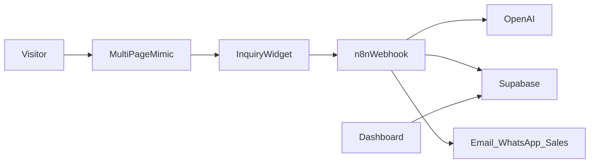

# PRD: ALBA CARS AI Customer Desk

| Field | Value |
| --- | --- |
| **Product name** | ALBA CARS AI Lead Acquisition Desk |
| **Status** | Draft for build |
| **Primary sources** | [docs/project-brief.md](docs/project-brief.md), [docs/task.md](docs/task.md) |
| **Reference site** | [albacars.ae](https://albacars.ae/) |

This PRD is the build contract. Narrative detail and long message examples live in the project brief; assignment constraints live in `docs/task.md`.

---

## 1. Problem and goal

### Problem

[albacars.ae](https://albacars.ae/) pushes visitors into WhatsApp. That creates friction for people who are not signed into WhatsApp Web, do not want to leave the site, or do not know what to write. Messages arrive unstructured, so sales must manually interpret vehicle preference, budget, timeline, and contact details.

### Goal

Increase qualified website leads by:

- Replacing the WhatsApp-only bubble with an on-site inquiry desk
- Capturing intent, contact details, and page context
- Classifying and scoring leads with GPT
- Persisting everything in Supabase
- Sending an immediate, personalized next step
- Routing hot leads to sales (and voice-agent queue status when eligible)

---

## 2. Locked decisions

| Topic | Decision |
| --- | --- |
| Frontend | Multi-page look-alike of albacars.ae (Home + Buy / Sell / Finance-style pages) |
| Contact UX | Bottom-right inquiry widget **replaces** the WhatsApp chat bubble |
| Orchestration | n8n webhook workflow (branching, transforms, error handling, retries, idempotency) |
| Persistence | **Supabase Postgres** (not Google Sheets) for customers, leads, messages, logs |
| AI | OpenAI GPT API for classify / extract / summarize / draft confirmation |
| AI evaluation | Canned sample inquiries run through GPT; outputs inspectable in dashboard / Supabase |
| Internal UI | Lightweight dashboard (`/02-dashboard`) reading Supabase — not a full CRM |

---

## 3. Users and success criteria

### Users

| Audience | Needs |
| --- | --- |
| Website visitors | Ask about buy, sell/trade-in, test drive, finance, find a car, or general questions without WhatsApp |
| Sales / finance / appraisal | Structured leads, scores, briefs, and hot-lead alerts |
| Sales managers | Verifiable pipeline in Supabase + dashboard |
| Voice agent (downstream) | Eligible leads marked ready with phone, summary, and suggested opening |
| Reviewers (assignment) | Runnable n8n workflow, web app, dashboard, README, BUILD_LOG |

### Prototype must pass

- Accept inquiries without requiring WhatsApp
- Require email and/or phone; enforce channel ↔ contact rules
- Capture intent and website context
- Return valid structured AI JSON
- Create or update customer + lead in Supabase with a reference (`AC-#####`)
- Assign a useful lead score and CTA
- Persist outbound communications (messages) with delivery status
- Send a request-specific confirmation (email and/or WhatsApp when configured)
- Notify sales on hot / high-intent leads
- Mark voice-agent eligibility only when phone + consent exist
- Prevent duplicate processing via submission ID
- Record and recover from processing failures

---

## 4. Product surface (UI mimic)

### Pages (must)

Mimic the public marketing experience of [albacars.ae](https://albacars.ae/) closely enough that a reviewer recognizes the brand and flow. Minimum page set:

| Page | Purpose |
| --- | --- |
| **Home** | Hero (“Find Your Perfect Used Car…”), special deals / new stock teasers, trust signals (inspection, warranty, finance), showroom/contact strip, FAQ teasers |
| **Buy** | Browse / filter style inventory listing (static or mocked stock for MVP) |
| **Sell** | Hassle-free sell / trade-in value proposition and CTA into the widget (sell/trade intent) |
| **Finance** | Auto finance eligibility messaging and CTA into the widget (financing intent) |

### Shared chrome (must)

- Top nav aligned with alba: Home, Buy, Sell, Finance, and secondary links as stubs where needed (About, Contact, Team can be lightweight)
- Footer with phone `+97143772503`, showroom address (Al Quoz), hours Sun–Sat 9:30 AM – 10 PM, social placeholders
- Visual direction: dark/premium dealership feel consistent with the live site (not a generic purple SaaS theme)
- Demo disclaimer in footer: standalone prototype, not the production alba site

### WhatsApp replacement (must)

- **Do not** ship the live site’s “Chat on WhatsApp” floating bubble as the primary contact path
- Ship a **bottom-right inquiry desk** on all pages (same behavior site-wide)
- Optional secondary “prefer WhatsApp” link may appear inside the widget after submit or in footer; it must not be the only path

### Fidelity bar

- Must: layout hierarchy, brand name as hero-level signal on Home, primary CTAs (Show all cars / Sell / Check eligibility), inventory teaser sections
- Should: car cards, reviews/FAQ sections, team strip (can be static)
- Must not: claim live live inventory sync in MVP; use mocked vehicles with stable IDs for page-context demos

---

## 5. Inquiry widget requirements

### Step 1 — Intent

Prompt: **How can ALBA CARS help?**

| Intent | Internal category seed |
| --- | --- |
| Buy a car | `vehicle_purchase` |
| Sell or trade in my car | `trade_in` / `vehicle_sale` |
| Book a test drive | `test_drive` |
| Ask about financing | `financing` |
| Help me find a car | `vehicle_search` |
| Ask a question | `general_sales_question` |

### Step 2 — Form fields

| Field | Rule |
| --- | --- |
| Name | Optional in MVP |
| Email | Optional alone if phone present |
| Phone | Optional alone if email present; required for WhatsApp reply or voice-agent eligibility |
| Preferred reply channel | `email` \| `whatsapp` \| `both` — must match supplied contacts |
| Message | Optional but encouraged; guided by intent prompt |
| Consent | Required checkbox: ALBA may contact about this inquiry; WhatsApp / voice only if phone provided and consented |

**Validation:** at least one of email or phone; WhatsApp channel forbidden without valid phone.

### Step 3 — Contextual message prompts

| Intent | Prompt |
| --- | --- |
| Buy a car | Tell us the make, model, budget, or features you are looking for. |
| Sell or trade in | Tell us your car's make, model, year, mileage, and condition. |
| Book a test drive | Which vehicle would you like to test-drive, and when? |
| Financing | Which vehicle are you interested in, and what would you like to know? |
| Help me find a car | Tell us your budget, preferred body type, and must-have features. |
| Ask a question | What would you like to know about our vehicles or buying process? |

### Step 4 — Automatic context (payload)

Every submission must include:

- `submission_id` (client-generated UUID)
- Source site / app version
- Current page URL and page type (`home` \| `buy` \| `sell` \| `finance` \| `vehicle` \| …)
- Vehicle ID and name when on a vehicle detail or card deep-link
- Active search filters when relevant
- Referral / UTM when available
- Submission timestamp
- Intent, form fields, consent flags

### Step 5 — On-screen confirmation

Show success state with:

- Acknowledgement of the specific request (or a safe fallback if AI is slow)
- Reference number `AC-#####`
- Expected next step (agent will contact / book appointment / outside hours)

Long-form email/WhatsApp copy examples: see [docs/project-brief.md](docs/project-brief.md) § Message Examples.

---

## 6. System architecture



### Flow (happy path)

1. Widget POSTs JSON to n8n webhook
2. n8n validates contact + consent + `submission_id`
3. Idempotency: if `submission_id` already processed, return existing reference (no duplicate lead)
4. Lookup customer in Supabase by email or phone; create or update
5. Call OpenAI with system prompt + payload → structured JSON
6. Deterministic rules validate AI output (scores, CTA, voice eligibility)
7. Upsert lead + write `communications` + `processing_log`
8. Send confirmation on selected channels; track each independently
9. Hot leads → sales notification
10. Eligible phone leads → `voice_agent_queue` status `ready_for_voice_agent` (or equivalent)
11. Webhook response returns `{ reference, lead_id, summary }` for on-screen UI

Working hours, timezone, appointment URL, and expected response times are **configuration**, not hard-coded.

---

## 7. Supabase data model

Postgres is the system of record (replaces Google Sheets from the brief).

### Tables (must)

#### `customers`

| Column | Notes |
| --- | --- |
| `id` | UUID PK |
| `name` | nullable |
| `email` | unique when present |
| `phone` | unique when present (E.164 preferred) |
| `preferred_channel` | email / whatsapp / both |
| `contact_consent` | boolean |
| `whatsapp_consent` | boolean |
| `voice_consent` | boolean |
| `first_contact_at` / `last_contact_at` | timestamptz |
| `assigned_agent` | nullable text |
| `status` | e.g. active / closed |

#### `leads`

| Column | Notes |
| --- | --- |
| `id` | UUID PK |
| `submission_id` | unique — idempotency key |
| `reference` | e.g. `AC-10428` |
| `customer_id` | FK |
| `category` | AI category |
| `intent` | widget intent |
| `original_message` | text |
| `ai_summary` | text |
| `ai_raw` | jsonb |
| `vehicle_interest` / `vehicle_id` | text / nullable |
| `budget_aed` | nullable numeric |
| `buying_timeline` | text |
| `buying_intent` / `urgency` | text |
| `lead_score` | int 0–100 |
| `priority` | hot / warm / early |
| `recommended_action` / `recommended_cta` | text |
| `status` | open / contacted / booked / closed / spam |
| `source_page` / `page_context` | text / jsonb |
| `assigned_team` / `assigned_agent` | text |
| `next_follow_up_at` | timestamptz |
| `created_at` | timestamptz |

#### `communications` (messages)

| Column | Notes |
| --- | --- |
| `id` | UUID PK |
| `lead_id` | FK |
| `channel` | email / whatsapp / sales_alert / system |
| `message_type` | confirmation / alert / fallback |
| `content` | text |
| `delivery_status` | pending / sent / failed / skipped |
| `provider_message_id` | nullable |
| `error_details` | nullable |
| `sent_at` | timestamptz |

#### `appointments`

| Column | Notes |
| --- | --- |
| `id`, `lead_id`, `customer_id` | |
| `appointment_type` | consultation / test_drive / valuation / financing |
| `requested_at` / `confirmed_at` | |
| `vehicle` | text |
| `assigned_agent` | |
| `booking_source` | widget / voice / sales |
| `status` | requested / confirmed / cancelled / completed |

#### `voice_agent_queue`

| Column | Notes |
| --- | --- |
| `id`, `lead_id` | |
| `customer_name`, `phone` | |
| `preferred_language` | nullable |
| `ai_summary`, `suggested_opening` | |
| `status` | not_queued / ready / queued / call_attempted / appointment_scheduled / no_answer / human_follow_up |
| `call_result` / `appointment_outcome` | nullable |
| `updated_at` | |

#### `processing_log`

| Column | Notes |
| --- | --- |
| `submission_id`, `workflow_run_id` | |
| `status` | processing / success / partial / failed |
| `retry_count` | |
| `error_stage`, `error_message` | |
| `created_at`, `updated_at` | |

#### `ai_eval_runs` (sample evaluation)

| Column | Notes |
| --- | --- |
| `id` | UUID PK |
| `scenario_key` | e.g. `high_intent_rav4` |
| `input_payload` | jsonb |
| `model` | text |
| `output_json` | jsonb |
| `latency_ms` | int |
| `notes` | nullable |
| `created_at` | |

### Access

- n8n uses **service role** (or dedicated DB user) for writes
- Dashboard uses authenticated read (simple password / Supabase Auth for MVP)
- Public anon key must **not** allow unrestricted lead reads
- Enable RLS; deny public insert on CRM tables (widget talks to n8n only)

---

## 8. n8n workflow requirements

Maps to [docs/task.md](docs/task.md) core checklist and the brief’s end-to-end workflow.

### Assignment must-haves

| Requirement | How this product satisfies it |
| --- | --- |
| Trigger | Webhook from inquiry widget (+ manual/test trigger for samples) |
| External data | OpenAI API; Supabase REST/HTTP; optional email/WhatsApp provider APIs |
| Transformation | Normalize phone/email, map intent → category, reshape AI JSON, build templates |
| Conditional logic | Switch on category, score band, reply channel, working hours, voice eligibility |
| Error handling | `continueOnFail` / error branch; log to `processing_log`; alert on hot-lead failure |
| Verifiable output | Rows in Supabase + confirmation message + sales alert; screenshotable in README |

### Bonus (should)

- LLM node for classification / drafting
- Retry / backoff on flaky HTTP
- Idempotency on `submission_id`
- Optional sub-workflow for “send confirmation” or “upsert CRM”

### Node-level flow (logical)

1. Webhook  
2. Validate input  
3. Check duplicate `submission_id` in Supabase  
4. Upsert customer  
5. OpenAI → structured output  
6. Code/Set: score bands, CTA, voice gate  
7. IF/Switch: spam discard vs process; channel fan-out; hot vs warm  
8. Insert/update lead, communications, voice queue, log  
9. Send email / WhatsApp / sales notify  
10. Respond to webhook  

### Hand-in artifacts for `/03-n8n-workflow`

- Live n8n access **or** exported workflow JSON
- README: what/why, node-by-node, credentials placeholders, how to run, how to verify
- No real secrets in git

---

## 9. AI behavior and sample evaluation

### Capabilities (must)

- Classify sales intent / category
- Summarize request
- Extract vehicle preferences, budget (AED), timeline
- Estimate urgency and buying intent
- Score lead 0–100
- Recommend next action + CTA
- Draft personalized customer confirmation
- Draft concise sales brief
- Flag likely spam

### Categories

`vehicle_purchase` · `vehicle_search` · `test_drive` · `financing` · `trade_in` · `vehicle_sale` · `general_sales_question` · `spam`

### Example AI output contract

```json
{
  "category": "vehicle_purchase",
  "summary": "Customer wants a recent Toyota RAV4 and plans to buy this month.",
  "vehicle": {
    "make": "Toyota",
    "model": "RAV4",
    "year_min": 2023,
    "budget_aed": 130000
  },
  "buying_timeline": "within_30_days",
  "buying_intent": "high",
  "urgency": "high",
  "lead_score": 87,
  "recommended_action": "Offer matching vehicles and schedule a consultation.",
  "recommended_cta": "book_sales_appointment",
  "voice_agent_eligible": true,
  "customer_confirmation": "Thanks for contacting ALBA CARS about a 2023 or newer Toyota RAV4...",
  "sales_brief": "High-intent buyer with AED 130,000 budget; contact today."
}
```

### Deterministic guardrails (must)

- AI suggestions never alone queue a voice call
- Voice queue requires valid phone + consent
- Spam category → no customer blast, log only
- If AI fails → template fallback confirmation; still store lead with `ai_raw` error

### Score bands

| Score | Priority | Action |
| --- | --- | --- |
| 80–100 | Hot | Immediate sales notify; voice queue if eligible |
| 50–79 | Warm | Normal follow-up task / status |
| 0–49 | Early | Useful CTA + nurture follow-up |

Weights remain configurable.

### Sample-response evaluation (must)

Provide a **sample pack** of canned inquiries (aligned with demo scenarios below) that can be POSTed to the same webhook or a dedicated “eval” path.

For each sample, store in `ai_eval_runs` (and/or create real leads tagged `source=eval`):

- Input payload
- Model name
- Full structured output
- Latency
- Human-readable notes field for reviewer comments

Dashboard **should** show a simple “AI samples” view: scenario name, category, score, drafted confirmation.

Env: `OPENAI_API_KEY` via `.env` / n8n credentials only (never committed).

---

## 10. Notifications and CTAs

### Confirmation content (every channel)

- ALBA received the inquiry
- Name when known
- Specific reference to the request
- Reference number
- Next expected action
- Relevant CTA (appointment link, valuation, finance page, etc.)

### CTA by intent family

| Family | CTAs |
| --- | --- |
| Buy / find | Book consultation; view stock; expect sales/voice call |
| Test drive | Pick time; confirm vehicle/branch; expect call if needed |
| Financing | Finance consult; finance info page; finance team follow-up |
| Sell / trade-in | Valuation appointment; docs checklist; appraisal call |
| Outside hours | Received after hours + appointment link (config-driven copy) |

### Sales alerts (immediate)

Hot lead · test drive · buy-soon · available vehicle request · high-intent but cannot voice-queue · all confirmation channels failed

Partial success: if email succeeds and WhatsApp fails, retry must **not** resend email.

---

## 11. Repo and hand-in shape

Preferred monorepo layout from [docs/task.md](docs/task.md):

```text
/
  README.md                 # links to live app, dashboard, n8n notes
  BUILD_LOG.md
  prd.md
  .env.example
  /01-web-app               # multi-page mimic + inquiry widget
  /02-dashboard             # Supabase-backed lead / message / AI eval views
  /03-n8n-workflow          # exported JSON + workflow README
  /docs
    project-brief.md
    task.md
```

Each folder: README, run instructions, `.env.example` as needed. **Never commit real secrets.**

---

## 12. MVP vs later

### MVP (ships)

- Multi-page UI mimic + inquiry widget replacing WhatsApp bubble
- n8n webhook pipeline with OpenAI + Supabase
- Personalized confirmation (email required path; WhatsApp when provider configured)
- Hot-lead sales notification
- Appointment CTA link (config URL)
- Voice-agent **eligibility + queue status** (no live dialer required)
- Sample AI evaluation pack + stored outputs
- Dashboard to verify leads, messages, eval runs
- Error logging, retries, idempotency

### Later (explicitly out of MVP)

- Live inventory matching / recommendation engine
- Direct voice-agent dial API
- Live sales calendar sync
- Multilingual EN/AR forms and confirmations
- Full CRM (pipelines, SLAs, assignment rules by branch)
- Production embed on real albacars.ae
- Autonomous financing decisions

---

## 13. Gaps / what’s missing

Items that are required for a production alba rollout or richer demo, but are **not blockers** for the assignment MVP if called out in README/BUILD_LOG:

| Gap | Impact | MVP mitigation |
| --- | --- | --- |
| WhatsApp Business API credentials & templates | No real WA delivery | Mark channel `skipped` / sandbox; still store intended message |
| Production email provider (SendGrid/Resend/etc.) | Confirmations may be stubbed | Use one real provider in demo **or** log “would send” body in `communications` |
| Voice-agent API contract | Cannot auto-dial | Status field `ready_for_voice_agent` only |
| Live alba inventory / search APIs | Buy page not real-time | Mocked stock with stable IDs |
| Legal/branding for cloning albacars.ae | Risk if presented as official | Footer demo disclaimer |
| Appointment calendar source of truth | CTA is a static URL | Config `APPOINTMENT_URL` |
| Hardened dashboard auth | Internal data exposure | Simple auth or private deploy for review |
| Arabic / multilingual | UAE audience incomplete | English-only MVP |
| Real site embed / CSP / consent CMP | Not production-ready | Standalone demo host |
| Daily/weekly digest reports | Nice-to-have from brief | Optional scheduled n8n; not required for first demo |
| Duplicate customer merge edge cases | Data quality | Match on normalized email **or** phone; document limits |

If anything else surfaces during build (provider limits, CORS, n8n Cloud plan caps), record it in `BUILD_LOG.md`.

---

## 14. Demo / acceptance scenarios

1. **High-intent buyer** — Recent Toyota RAV4 under AED 130,000 → hot lead, sales alert, voice-ready if phone+consent, appointment CTA, confirmation references RAV4/budget.
2. **Test drive** — Honda Civic Saturday → preferred time captured, test-drive CTA, lead category `test_drive`.
3. **Trade-in** — 2020 Nissan Altima + wants SUV → both needs in summary, valuation CTA.
4. **Buy-page context** — Submit from a mocked vehicle card → `vehicle_id` / name stored on lead.
5. **Dual channel** — Email + WhatsApp selected → two `communications` rows with independent statuses.
6. **Voice handoff copy** — Eligible lead gets confirmation mentioning automated assistant call; queue row `ready`.
7. **AI sample pack** — Run canned scenarios through GPT; dashboard/Supabase shows category, score, drafted reply for each.
8. **Idempotency** — Resubmit same `submission_id` → no second lead; same reference returned.
9. **AI failure fallback** — Force OpenAI error in test → fallback confirmation + `processing_log` failure stage recorded; lead still saved when possible.

---

## 15. Open assumptions

- Google Sheets from the original brief is **replaced by Supabase** for this build.
- n8n Cloud free trial is acceptable for review ([docs/task.md](docs/task.md)).
- Working hours default to showroom hours on alba (Sun–Sat 9:30–22:00 Asia/Dubai) until config overrides.
- Appointment CTA points to a configurable URL (Calendly or placeholder page).
- “Mimic UI” means faithful marketing recreation for demo, not pixel-perfect reverse-engineering of all alba micro-interactions.
- Sales notification channel for MVP: email and/or Slack webhook (choose one in BUILD_LOG and document).

---

## 16. Traceability

| PRD area | Source |
| --- | --- |
| Widget intents, CTAs, AI schema, scenarios | [docs/project-brief.md](docs/project-brief.md) |
| n8n checklist, hand-in folders, README rules | [docs/task.md](docs/task.md) |
| Multi-page mimic + Supabase + sample GPT eval | Product owner lock (this PRD) |
